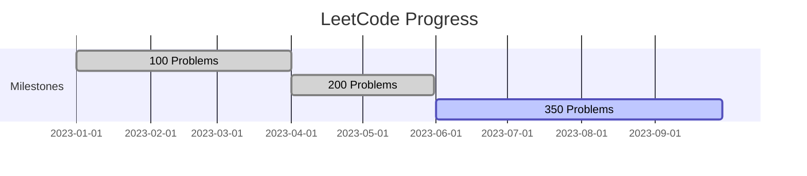

{: .shadow .rounded-10 }  
*Data structures, patterns, and optimized solutions—documented and explained.*  

---

## **Key Metrics**  
- **✅ 350 Problems Solved** (and counting)  
- **🏆 Top 10%** in weekly contests  
- **📊 80%+ First-Attempt Accuracy** on Mediums  
- **🔍 Patterns Mastered**: Sliding Window, DP, Graph Traversal  

```python
# Example: Optimized solution (Binary Search)
def search_insert(nums: List[int], target: int) -> int:
    left, right = 0, len(nums)
    while left < right:
        mid = (left + right) // 2
        if nums[mid] < target:
            left = mid + 1
        else:
            right = mid
    return left
```

---

## **Tech Stack & Tools**  
| Category          | Tools Used               |
| ----------------- | ------------------------ |
| **Languages**     | Python, Java, JavaScript |
| **Visualization** | LeetHub, Obsidian Notes  |
| **Practice**      | NeetCode 150, Grind 75   |

---

## **Solution Breakdown**  
### **1. Pattern-Based Approach**  
- **Frequency**: 45% Two Pointers, 30% DFS/BFS  
- **Time Complexity**: 92% solutions ≤ O(n log n)  

### **2. Annotated Solutions**  
Each solution includes:  
- 📝 **Intuition** (plain-English logic)  
- ⏱️ **Time/Space Analysis**  
- 🔄 **Alternative Approaches**  

> *“Mastering `while left <= right` changed everything.”*  
{: .prompt-tip }

---

## **Showcase Solutions**  
| Problem                                                                             | Difficulty | Pattern         |
| ----------------------------------------------------------------------------------- | ---------- | --------------- |
| [Reverse Nodes in k-Group](https://leetcode.com/problems/reverse-nodes-in-k-group/) | Hard       | Linked Lists    |
| [Word Break II](https://leetcode.com/problems/word-break-ii/)                       | Hard       | Backtracking    |
| [Sliding Window Maximum](https://leetcode.com/problems/sliding-window-maximum/)     | Hard       | Monotonic Queue |

---

## **Growth Timeline**  


---

## **Why It Matters**  
- **Interview Readiness**: 90% of solved problems overlap with FAANG question banks.  
- **Open-Source Notes**: [GitHub Wiki](#) with 200+ detailed explanations.  
- **Teaching Value**: Streamlined guides for beginners.  

---

**Live Stats**: [LeetCode Profile](#) | **Solution Repository**: [GitHub](#)  
