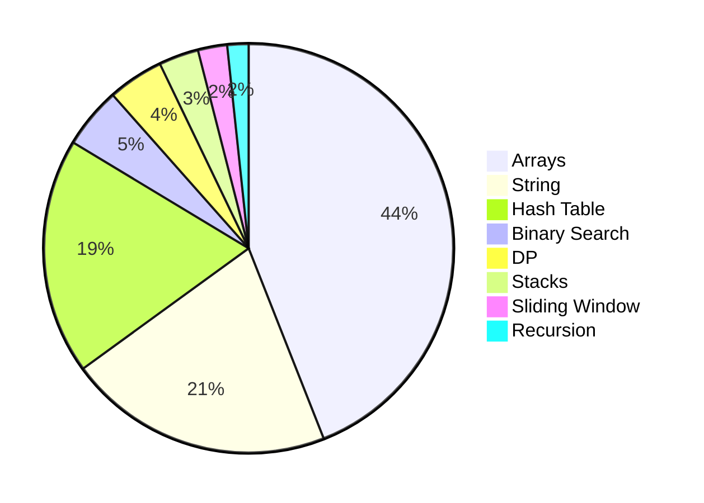

<!-- {: .shadow .rounded-10 }  
*Data structures, patterns, and optimized solutions—documented and explained.*   -->

---

## **Key Metrics**  
- **✅ 350 Problems Solved** (and counting)  
- **📊 68.34%+ First-Attempt Accuracy** across all problems
- **🔍 Patterns I love dealing with**: Sliding Window, DP, Graph Traversal, Stacks, Array, and Dictionaries

---

| Problem Type | Solutions Completed |
|-------------------|--------------------------|
| **Array** | 210 |
| **String** | 100 |
| **Hash Table** | 89 |
| **Binary Search** | 23 |
| **DP** | 21 |
| **Stacks** | 15 |
| **Sliding Window** | 11 |
| **Recursion** | 8 |

{::nomarkdown}
    <blockquote class="prompt-info"> 
        <strong>
            Important Note
        </strong>
        Many LeetCode problems belong to multiple categories, so the sum of individual category solves may exceed my total problem count. 
    </blockquote> 
{:/nomarkdown}
---

## **Growth Timeline**  
timeline
    title Coding Journey
    2024 : Started LeetCode
    2024 Q2 : First 100 problems
    2025 Q1 : Reached 200
    Now : 350+ and counting

---

## **Why I Solve Leetcode Problems**  
- **Interview Readiness**: I want to essentially ready myself just incase of coding assessments
- **It Avoids Stagnation**: While LeetCode may not directly improve real-world software engineering skills, it serves as valuable mental exercise
- **Teaching Value**: Streamlined guides for beginners.

---

